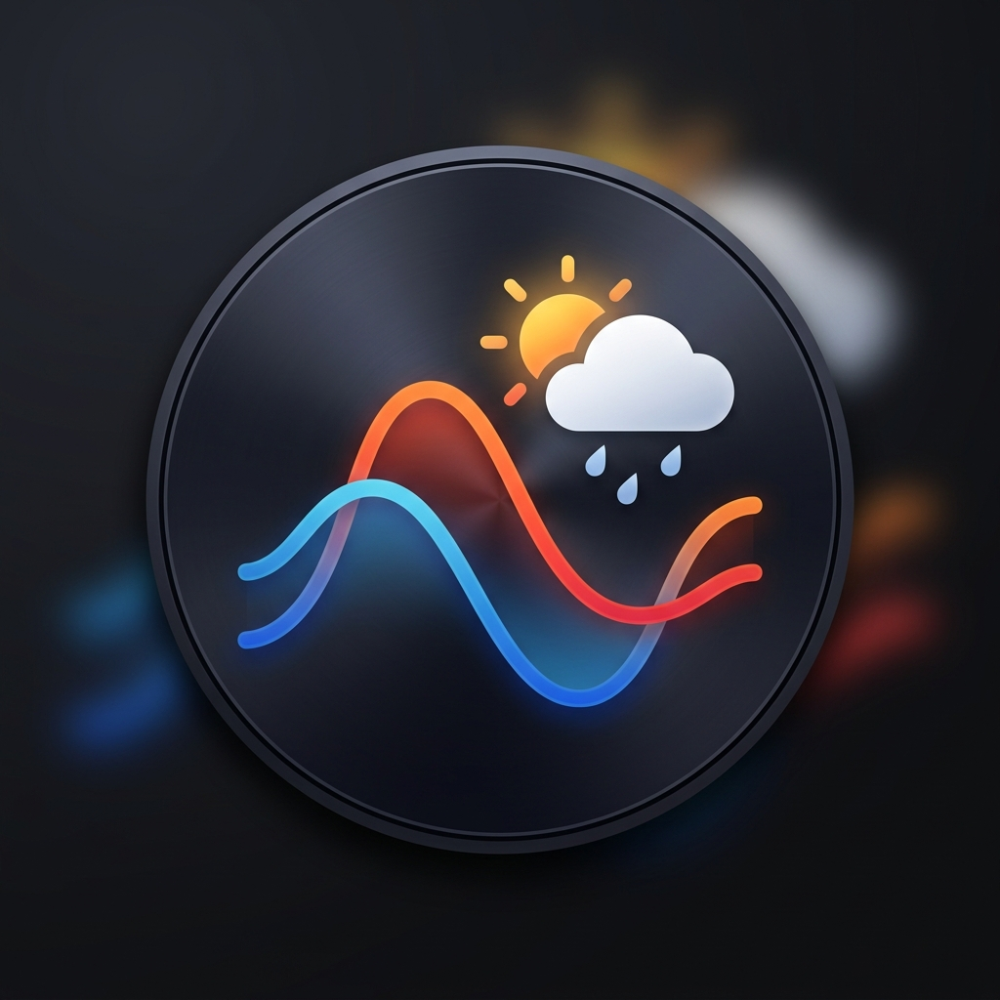
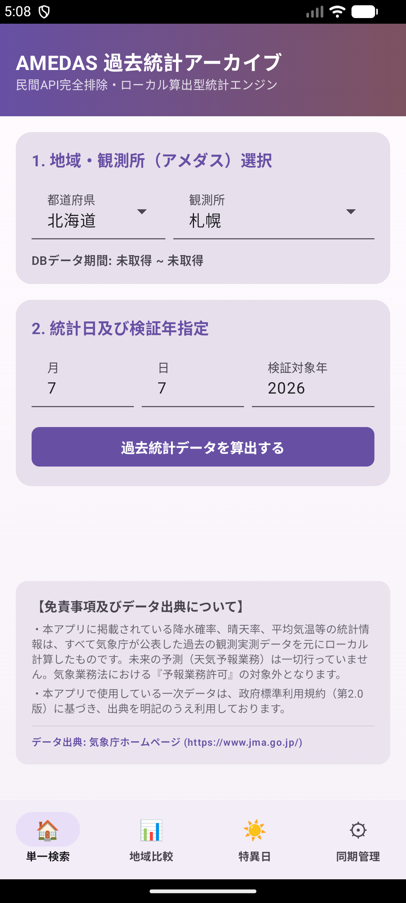
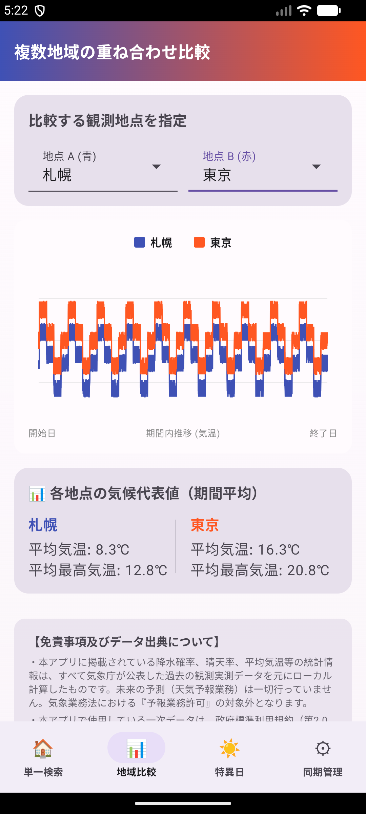
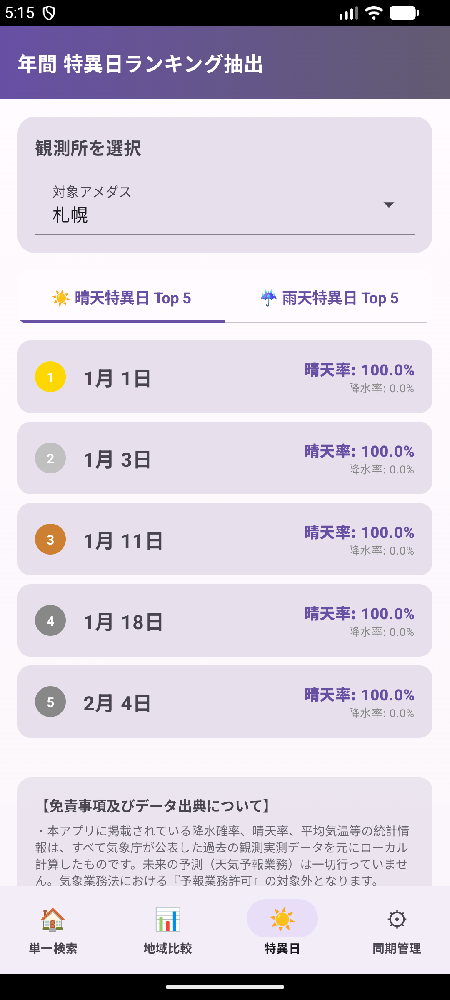
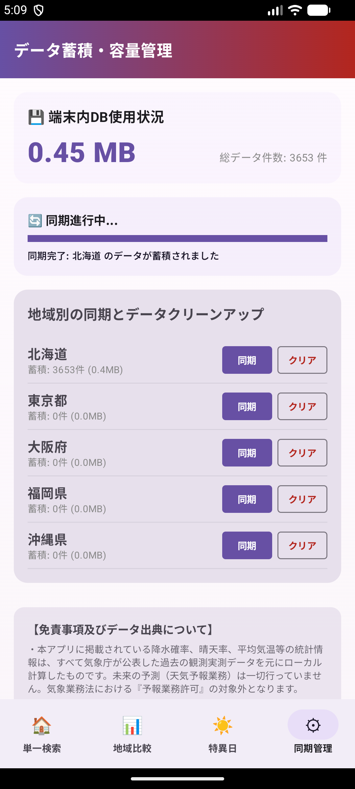

# 📱 AMEDAS-Archive

<p align="center">
  
</p>

気象庁が提供する過去の気象観測実測データをAndroid端末内にローカル蓄積（Room SQLite）し、民間APIに依存せずに独自の高度な気象統計分析、地域比較、および特異日抽出を算出・可視化する完全オフライン対応のAndroidアプリケーションです。

---

## 📸 スクリーンショット（動作実証ギャラリー）

| ① 単一統計検索画面 | ② 地域比較・重ね合わせ Canvas グラフ |
|:---:|:---:|
|  |  |
| **③ 特異日ランキング画面** | **④ 容量管理・WorkManager同期管理** |
|  |  |

---

## 🌟 主な特徴

1. **完全ローカル統計エンジン**
   - 外部の有料気象APIや独自サーバーを一切使用せず、取得したデータから端末内だけで降水確率や平均気温、晴天率などを瞬時に算出します。
2. **高速・省メモリなCSVインポート**
   - 気象庁の提供する過去CSVデータをストリーム処理（Shift_JIS対応）し、端末のリソース（メモリ・バッテリー）を最小限に抑えて高速にデータベースへ格納します。
3. **バックグラウンド同期（WorkManager）**
   - 都道府県単位の一括ダウンロードなど、時間がかかる処理は `WorkManager` でバックグラウンド実行されます。進捗（「〇/〇 地点完了」など）は画面上でリアルタイムに把握できます。
4. **2地点の比較・重ね合わせグラフ**
   - 2つの異なる観測所の同一期間データを重ね合わせて表示し、気候の違いを視覚的に比較できます。
5. **法的コンプライアンス（気象業務法）適合**
   - 本アプリは「予報業務」を行いません。過去の観測実績データに基づく「統計情報」のみを処理して提示し、必要な免責文言および気象庁への出典明記をUIに徹底しています。

---

## 🏗 パッケージ・アーキテクチャ構造

本プロジェクトは、GitHubでの共同開発や機能拡張を容易にするため、**MVVM** および **クリーンアーキテクチャ** の3レイヤー概念に準拠して設計されています。

```mermaid
graph TD
    subgraph Presentation Layer (UI/ViewModel)
        UI[Jetpack Compose UI] --> VM[ViewModel]
    end
    subgraph Domain Layer (Pure Kotlin Business Logic)
        VM --> UC[UseCase]
        UC --> Model[Domain Model]
        UC --> RepoInterface[Repository Interface]
    end
    subgraph Data Layer (Data Sources)
        RepoImpl[Repository Implementation] -- implements --> RepoInterface
        RepoImpl --> Local[Room DB / SQLite]
        RepoImpl --> Remote[AmedasCsvParser / Net]
    end
```

### パッケージ構成
```text
app/src/main/java/com/example/amedasarchive/
├── data/            # データ層 (気象庁アクセス、Room DB、Repository実装)
│   ├── local/       # Room Entity, DAO, AppDatabase
│   ├── remote/      # スクレイピング / CSVパース処理
│   └── repository/  # Repositoryの具体的な処理
├── domain/          # ビジネスロジック層 (UseCase, モデル, Repository境界)
│   ├── model/       # 純粋なデータモデル (WeatherStats等)
│   ├── repository/  # Repositoryのインターフェース
│   └── usecase/     # 統計計算、特異日検索、差分ダウンロードの各ロジック
└── presentation/    # UI/表現層 (Jetpack Compose, ViewModel)
    ├── components/  # 共通パーツ (プログレスバー、警告UI、共通グラフなど)
    ├── compare/     # 地域比較画面のUI & ViewModel
    ├── home/        # メイン・単一検索画面のUI & ViewModel
    ├── manage/      # 容量管理・地域ダウンロード画面のUI & ViewModel
    └── singularity/ # 特異日検索画面のUI & ViewModel
```

---

## 🛠 ビルドおよび開発環境

本アプリをローカルでビルドし、エミュレータまたは実機に展開する手順です。

### 前提条件
* **JDK / JBR**: Version 17
  - ビルドが失敗する場合は、Android Studioに同梱されている JetBrains Runtime (JBR) の指定を推奨します。
* **Android SDK**: API Level 34以上

### ビルド手順

1. 本リポジトリをクローンします。
   ```bash
   git clone https://github.com/iwa-kasoutuuuuuka/AMEDAS-Archive.git
   cd AMEDAS-Archive
   ```
2. ビルドコマンドを実行します（Android Studio JBRの Java を使用する場合の例）。
   - **PowerShell (Windows)**:
     ```powershell
     $env:JAVA_HOME="C:\Program Files\Android\Android Studio\jbr"
     ./gradlew assembleDebug
     ```
   - **Linux / macOS**:
     ```bash
     export JAVA_HOME="/Applications/Android Studio.app/Contents/jbr/Contents/Home" # macOS例
     ./gradlew assembleDebug
     ```
3. ビルドが成功すると、以下のパスに動作検証用APKが出力されます。
   `app/build/outputs/apk/debug/app-debug.apk`

---

## 📦 即時インストール (リリースAPK)

本リポジトリのリリースまたは `release/` フォルダ配下に、ビルド済みの動作検証用APKを同梱しています。
端末にダウンロードしてインストールすることで、ビルド環境がなくとも動作をご確認いただけます。

📂 **ビルド済みAPKのパス**: [release/app-debug.apk](./release/app-debug.apk)

---

## ⚖️ 免責事項・ライセンス

### 1. 気象業務法に関する表記
本アプリが提供する情報は、すべて過去の気象観測実測データを元に統計的な計算を施したものであり、**未来の天候を予測する「気象予報（予報業務）」は一切行っていません**。そのため、気象業務法第17条（予報業務の許可）に基づく許可対象外となります。

### 2. 出典明記（政府標準利用規約 2.0 準拠）
本アプリ内で処理・蓄積される過去の気象データは、気象庁が提供する「過去の気象データ」を二次利用したものです。
- **データ出典**: [気象庁ホームページ](https://www.jma.go.jp/)
